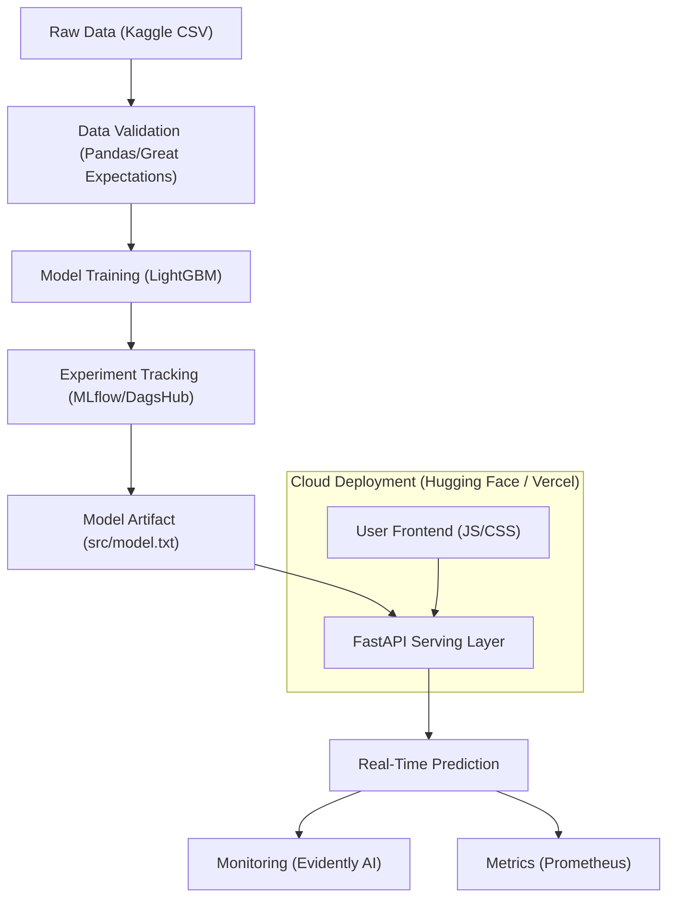

# 🏗️ System Architecture: FraudShield AI

This document provides a deep dive into the technical design and data flow of the FraudShield AI ecosystem.

## 📡 Overall Data Flow

The system follows a modern MLOps pattern, separating the training/validation environment from the high-performance serving environment.

## 🛠️ Component Breakdown

### 1. Data Foundation Layer
*   **Dataset**: Uses the real Kaggle "Credit Card Fraud Detection" dataset (284k+ rows).
*   **Validation**: Every time data is processed, `scripts/data_validation.py` ensures schema integrity (30 features, no nulls, correct price ranges).
*   **Versioning**: DVC is used to track data versions without bloat the Git repository.

### 2. Model Engineering Layer
*   **Algorithm**: LightGBM was chosen for its extreme speed and ability to handle the 1:578 class imbalance ratio via `scale_pos_weight`.
*   **Features**: 30 total (Time, V1-V28, and Amount).
*   **Tracking**: Every training run is logged to **DagsHub (MLflow)**, tracking hyperparameters, metrics (F1-score, Recall), and the final model file.

### 3. Serving & Infrastructure
*   **API**: A FastAPI application ([src/app.py](file:///e:/Programming/Antigravity Agent Manager folder/RealTimeCreditCardFraudDetectionApi/src/app.py)) provides a `/predict` endpoint.
*   **Frontend**: A responsive, glassmorphic UI ([frontend/index.html](file:///e:/Programming/Antigravity Agent Manager folder/RealTimeCreditCardFraudDetectionApi/frontend/index.html)) communicates with the API.
*   **Containerization**: The entire app is wrapped in a **Docker** image for easy deployment.

### 4. CI/CD Pipeline
*   **GitHub Actions**: On every push, the system:
    1. Installs system dependencies (`libgomp1`).
    2. Generates a fresh mock dataset for testing.
    3. Validates the code via a smoke test.
    4. Automatically pushes to **Hugging Face Spaces**.

### 5. Monitoring & Observability
*   **Drift Detection**: Evidently AI analyzes the difference between production input and training data to detect "Model Decay."
*   **Metrics**: Prometheus scrapes transaction volume and latency from the API.

---
*Return to [README.md](file:///e:/Programming/Antigravity Agent Manager folder/RealTimeCreditCardFraudDetectionApi/README.md)*
